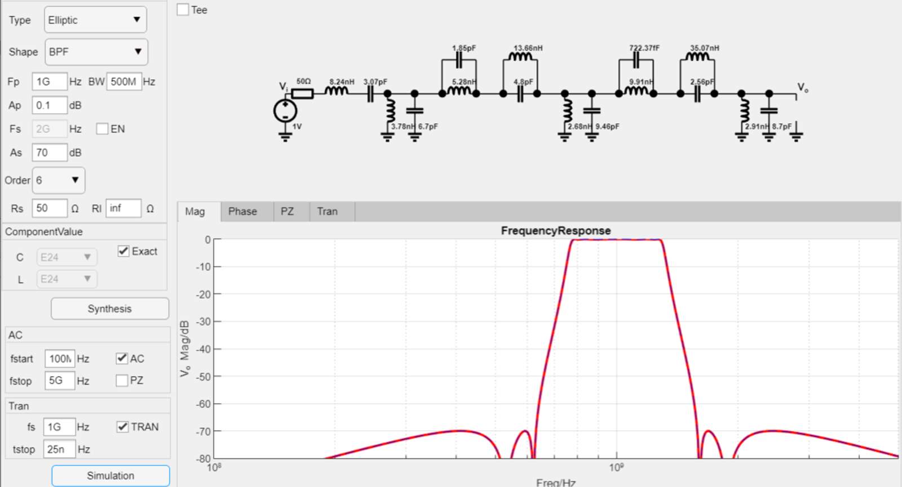

# Matlab椭圆滤波器设计APP(MatlabEllipticFilterDesignApp)
> 这是一个Matlab版本滤波器设计APP，目的是为了进行无源滤波器设计，更多可以关注微信公众号"[电路设计小工具](https://mp.weixin.qq.com/s/fxfEnir-hU0YvF9_CWyI6g)".

### 如何使用(how to use)
下载整个文件包，双击eToolsFilterDesignApp.mlapp运行即可。

### 运行环境(Env)
win10, Matlab2021a

### 程序结构

更多技术细节可以参考$^{[1][2][3][4][5][6][7]}$

### 特性
基于Matlab的appdesign工具开发了一套滤波器设计软件，主要特点是：
- 支持椭圆滤波器(Elliptic/Cauer)、切比雪夫滤波器(Chebyshev I)、逆切比雪夫滤波器(Chebyshev II, Inverse Chebyshev)和巴特沃斯滤波器(Butterworth)设计
- 支持4种不同滤波器通带类型(LPF,HPF,BPF,BRF)设计
- T型和PI型结构滤波器随意切换
- 可以设置阻带衰减决定滤波器阶数
- 可以设置通带衰减来综合滤波器
- 可以随意配置负载和终端阻抗，并支持一端接载(源端电阻短路，源端电流源，终端开路，终端短路)设计
- 可以幅频响应分析、零极点分析、瞬态分析
- 可以显示理想频率响应、零极点和实际仿真的的频率响应、零极点
- 可以支持实际标准器件逼近设计

### 运行效果(demo)

#### Elliptic LPF设计举例
设计一款-3dB截止频率为1GHz, 阻带纹波为60dB, 7阶低通Elliptic滤波器，输入输出阻抗为50欧姆，设计过程如下：

最终设计参数如下：

零极点仿真结果：

#### Elliptic BPF设计举例
设计6阶带通Elliptic滤波器, 通带纹波为0.1dB, 阻带衰减为70dB, 中心频率为1GHz，带宽为500MHz，50欧姆输入，输出阻抗为高阻，最后进行瞬态仿真，设计过程如下：

最终设计参数如下：

瞬态仿真结果：

程序的Matalb源码已经上传GitHub中$^{[7]}$(https://github.com/etools361/MatlabEllipticFilterDesignApp)，有兴趣的同学可以下载试用体验，当然也欢迎技术交流。

### 参考(ref)
[1] : [模拟无源滤波器设计（一）-滤波器历史](https://mp.weixin.qq.com/s/wNRHyBHpimjU90bymHp7JA) \
[2] : [模拟无源滤波器设计（二）-梯形网络综合](https://mp.weixin.qq.com/s/3GMQs4WDm683tdAXqyoOgQ) \
[3] : [模拟无源滤波器设计（三）-梯形网络仿真](https://mp.weixin.qq.com/s/nZFx7weLcO-WRKLbP0T4jQ) \
[4] : [模拟无源滤波器设计（四）-通用无源网络仿真](https://mp.weixin.qq.com/s/mllwGShvbh3TWdFRbp9LhQ) \
[5] : [模拟无源滤波器设计（五）-Butterworth滤波器设计详解](https://mp.weixin.qq.com/s/pIMPIh8ize49mxXG4SHT_w) \
[6] : [模拟无源滤波器设计（六）-Chebyshev滤波器设计详解](https://mp.weixin.qq.com/s/6b1HF81X93M9D4yfIAFROw) \
[7] : [模拟无源滤波器设计（七）-Elliptic滤波器设计详解](https://mp.weixin.qq.com/s/6b1HF81X93M9D4yfIAFROw) \
[7] : [欢迎关注电路设计小工具公众号](https://mp.weixin.qq.com/s/fxfEnir-hU0YvF9_CWyI6g) \
[8] : [Matlab源码地址](https://github.com/etools361/MatlabEllipticFilterDesignApp)
